# StickerAndDecalShader
  
簡単に、"歪まない"シールが貼れるShaderです！  
## 目次
- [使い方](#使い方)
    - [Avatar用途](#Avatar用途)
    - [World用途](#World用途)
	- [使用上の注意 ⚠️重要⚠️](#使用上の注意)
	- [Shaderの設定項目の説明](#Shaderの設定項目の説明)
## 使い方
### Avatar用途
⚠️本Shaderは[Modular Avatar](https://modular-avatar.nadena.dev/ja)を使うと体にくっつけたりするのが比較的簡単にできます！
- 導入
    - 商品購入後に同封されているunitypackageを使用するUnityのプロジェクトに入れる！
- 必要なものを入れる
    - [Modular Avatar](https://modular-avatar.nadena.dev/ja)をプロジェクトに入れる！
    - **Depth Observer** PrefabをAvatar直下に入れる！  
    💡Appletea's Item/Sticker & Decal Shader/[バージョン]/Prefab に入っています！  
- くっつける！

| Prefab設置 | 位置と回転の調整 | Scaleの調整 |
|---|---|---|
|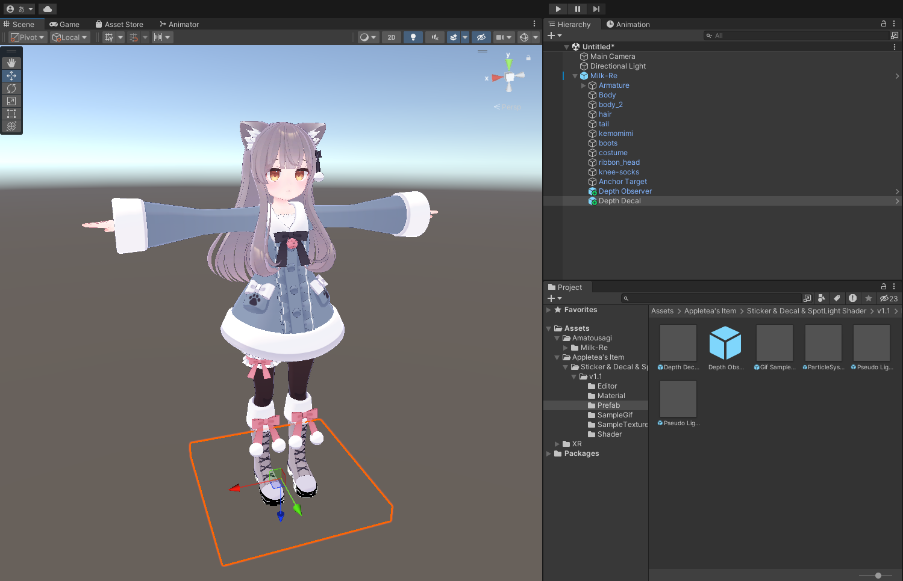|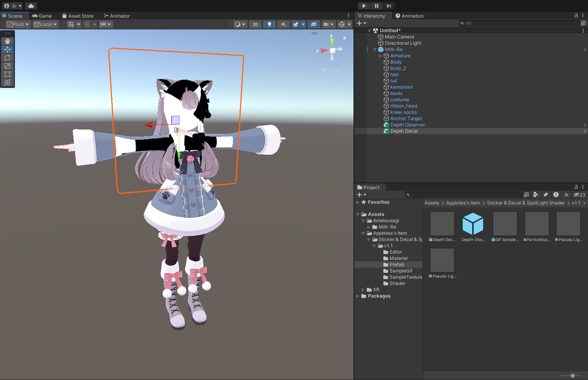|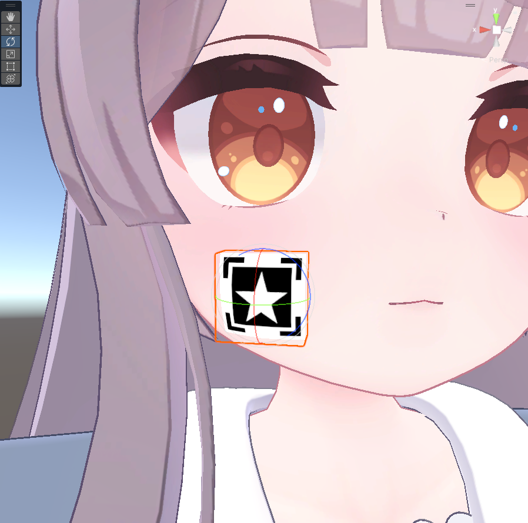|  

    - Depth Decal PrefabをScene上に置き、**貼り付けたい面に密着させて**、z軸を貼り付けたいものに向けます  
    💡Stickerが有効な範囲はCubeの内側！向きと位置を合わせてね！  
    - Scaleからサイズを調整、z軸の大きさは少し大きめに取ります  
    💡Avatarでは体を曲げたりするときにStickerの有効な範囲から外れちゃうことがあるのでz軸の大きさは少し大きめに取ってね！  

| Material複製 | 画像を交換、Shader設定 | 見た目の確認 |
|---|---|---|
|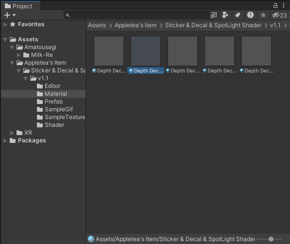|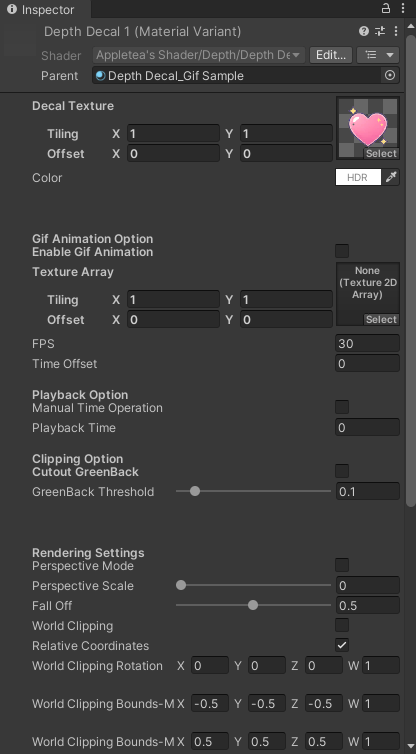|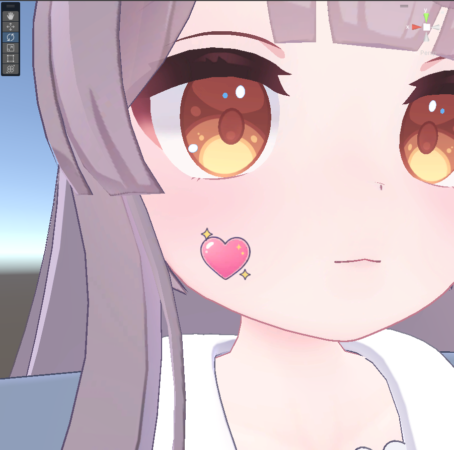|  

    - Materialを複製する！  
    💡2種類以上のStickerを使いたいときは複製してね！複製はMaterialを選択してCtrl + Dでできるよ！  
    - [Shaderの設定項目](#Shaderの設定項目の説明)を参考に好きな画像を貼り付ける！  

| MA Bone ProxyをAdd Componentで追加 | ターゲットに追従させるボーンを設定 |
|---|---|
|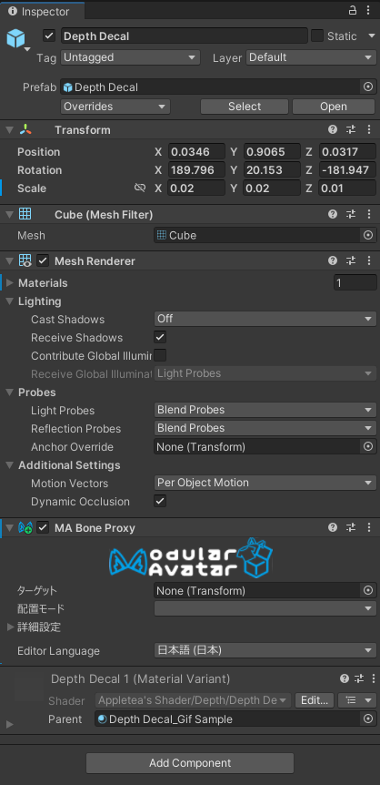|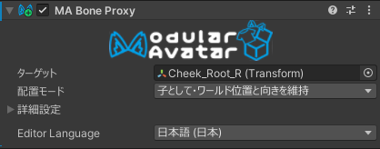|

    - Stickerのオブジェクトに**MA Bone Proxy**を追加する
    - **MA Bone Proxy**のターゲットに追従させたいボーンを設定する
- GIF画像を貼り付ける！  

| Editorを開く | GIF画像を変換する | Shaderに登録する |
|---|---|---|
|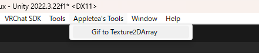|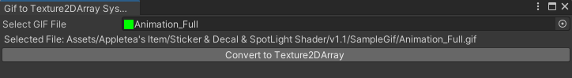|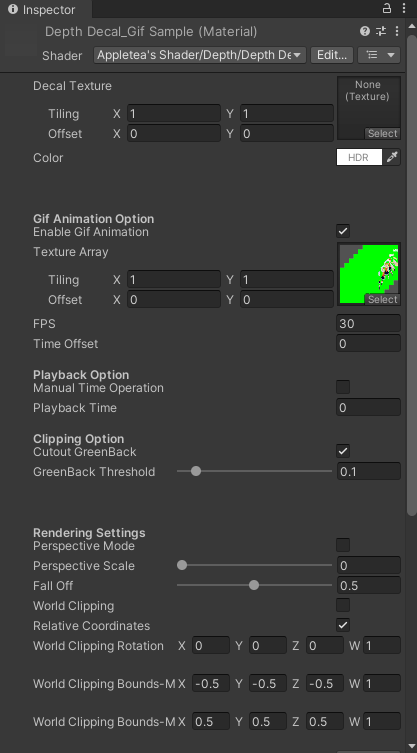|   

    - GIF画像の変換
        - Unity画面上のタブにある**Appletea's Tools**から、**Gif to Texture2DArray**を選択してウィンドウを開く
        - 変換したいGIF画像を**Select GIF File**に入れる
        - **Convert to 2DTextureArray**ボタンを押して変換！  
        💡変換したファイルは自動的に保存されるので、後のShader設定で入れよう！  
    - Gif Sample_Depth Decal PrefabをScene上に置き、**貼り付けたい面に密着させて**、z軸を貼り付けたいものに向けます  
    💡Stickerが有効な範囲はCubeの内側！向きと位置を合わせてね！  
    - Scaleからサイズを調整、z軸の大きさは少し大きめに取ります  
    💡Avatarでは体を曲げたりするときにStickerの有効な範囲から外れちゃうことがあるのでz軸の大きさは少し大きめに取ってね！
    - Materialを複製する！  
    💡2種類以上のStickerを使いたいときは複製してね！複製はMaterialを選択してCtrl + Dでできるよ！  
    - [Shaderの設定項目](#Shaderの設定項目の説明)を参考に好きなGIF画像を貼り付ける！  
    💡通常の画像とは設定場所が違うので注意！  
    - Stickerのオブジェクトに**MA Bone Proxy**を追加する
    - **MA Bone Proxy**のターゲットに追従させたいボーンを設定する

[使用上の注意](#使用上の注意)にも記載がありますが、**Depth Observer** PrefabをAvatar直下に入れてください。
### World用途
商品購入後に同封されているunitypackageを使用するUnityのプロジェクトに取り込み、  
> Appletea's Item/Sticker & Decal Shader/[バージョン]/Prefab

フォルダ内のPrefabをSceneに配置してご利用ください。
各Prefabの詳細を以下に示します。

- Depth Decal.prefab  
画像を貼り付ける場合にご利用ください。

- Gif Sample_Depth Decal.prefab  
GIF画像を貼り付ける場合にご利用ください。

- ParticleSystem_Depth Decal.prefab  
StickerをParticleでばらまく用途にご利用ください。

- Pseudo Light Inverse_Depth Decal.prefab  
負の光を表現するスポットライトサンプルです。設定やマスクをいじってご利用ください。

- Pseudo Light_Depth Decal.prefab  
スポットライトを表現するサンプルです。設定やマスクをいじってご利用ください。

### 使用上の注意
本商品を使用するためにいくつか注意すべき点があります。

1. SceneのDepth Texture発行に関して  
    - Avatarで使う場合  
    本商品に含まれる、**Depth Observer** PrefabをAvatar直下に入れてください。  
    💡Appletea's Item/Sticker & Decal Shader/[バージョン]/Prefab に入っています！  
    ⚠️LightをAvatarに入れることになるので、アバターランクがPoorになる点にご注意ください。
    - Worldで使う場合  
    本商品のShaderはUnityの深度情報を利用しているため、使用する際は
	    - Directional Light (Realtime Mode, Shadow)
	    - [VUdon - Depth Buffer Toolkit](https://github.com/Varneon/VUdon-DepthBufferToolkit)  

	    のような手段でDepth Textureを発行してください。

	    本来、VRChatの利用できないワールドで表示を切り替える設定を入れているのですが、VRChatのバグによって適切に切り替わらない問題があるため[バグ修正の投票](https://feedback.vrchat.com/bug-reports/p/vrc-camera-emits-inaccurate-depth-texture)にご協力ください。  
        💡バグはまだ直っていませんが、Shader側で対策できたため使用できないWorldでは自動的に切り替わります！
### Shaderの設定項目の説明
**注意！アップデートで項目が変更される場合があります！**

|

デフォルト設定から変更する必要があまりない項目については解説を省いています。  
また、角度設定はすべてradianです。

- Decal Texture  
この項目では雲生成に使うNoiseを読み込ませます。仕様を理解して自分でTextureを描ける猛者以外はPrefabのデフォルト状態で利用してください。
- Color  
全体の色設定です。
- Gif Animation Option  
GIF画像を使う際の設定です。有料オプションに含まれています。
	- Enable Gif Animation  
	**GIF画像を使用する際にチェックを入れてください。**
	- Texture Array  
	[使い方](#使い方)で変換したGIF画像を入れてください。
	- FPS  
	画像を送る速度を設定します。  
	- Time Offset  
	GIF画像の再生タイミングをずらします。複数枚の画像で順番に動かしたい場合などにご利用ください。  
- Playback Option  
GIF画像の再生位置を手動設定するオプションです。
    - Manual Time Operation  
    **GIF画像の再生位置を手動設定する際にチェックを入れてください。**
    - Playback Time  
    再生時間を手動で設定できます。
- Clipping Option  
GIFのGreenBackを透過する処理です。
    - Cutout GreenBack  
    **GIFのGreenBackを透過する際にチェックを入れてください。**
    - GreenBack Threshold  
    GreenBackの透過閾値です。
- Rendering Setting  
描画に関する処理です。
    - Perspective Mode  
    **Fast Realtime Light用の機能**を有効にします。有料オプションに含まれています。  
    - Perspective Scale  
    距離が離れるにつれて投影が広がるようにする設定です。
    - Fall Off  
    距離に応じて光が弱くなるように設定できます。
    - World Clipping  
    World座標系で非表示にする範囲を設定する機能を有効にします。
    - Relative Coordinates  
    Local座標系で非表示にする範囲を設定する機能を有効にします。
    - World Clipping Rotation  
    非表示にする範囲を回転させます。  
    💡非表示にする範囲は四角なので、必要に合わせて回転できます！
    - World Clipping Bounds-Min  
    非表示にする範囲の設定です。
    - World Clipping Bounds-Max  
    非表示にする範囲の設定です。
    - Blend Op  
    透過処理に関する設定です。詳しくは[Unity公式ドキュメント](https://docs.unity3d.com/ja/2021.3/Manual/SL-BlendOp.html)をご覧ください。
    - Src Factor  
    透過処理に関する設定です。詳しくは[Unity公式ドキュメント](https://docs.unity3d.com/ja/2021.3/Manual/SL-Blend.html)をご覧ください。
    - Dst Factor  
    透過処理に関する設定です。詳しくは[Unity公式ドキュメント](https://docs.unity3d.com/ja/2021.3/Manual/SL-Blend.html)をご覧ください。
- Stencil Option  
Stencilに関する設定です。使える人は使ってください。
- Render Queue  
描画順設定です。特に変える必要はないです。
- Enable GPU Instancing  
GPU Instancingに対応しています。複数の全く同じMeshで同じMaterialのStickerを使う場合にご利用ください。
